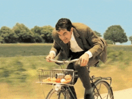

    

 

## ABOUT ME 🦊

<ul>
    <li>👨‍💻&nbsp; <b>Name:</b> Phuc (Benjamin) Nguyen (a.k.a <i><strong style="color:magenta;">techmoocher</strong></i>).</li> 
    <li>🪪&nbsp; <b>Title: </b> High school senior @ VNUHCM High School for the Gifted.</li> 
    <li>💖&nbsp; <b>Hobbies: </b> Running 🏃‍♂️, Cycling 🚴‍♂️, Piano 🎹, Reading 📖.</li>
</ul>

### Me doing my hobbies :)

    
    
    
    

